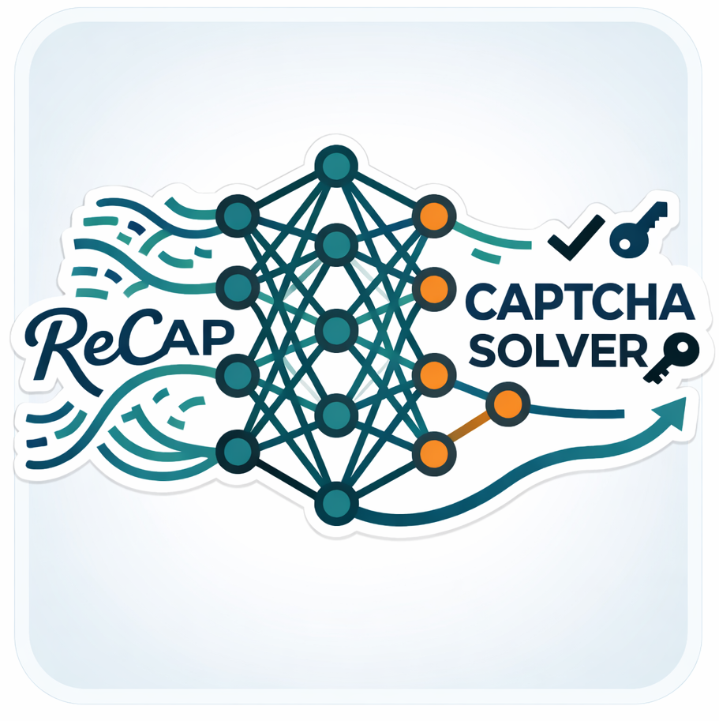
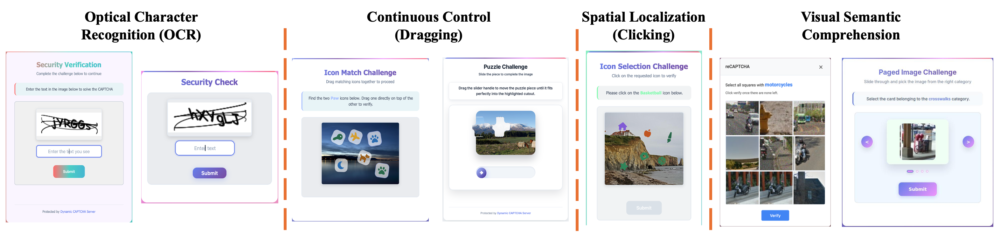

<p align="center">
  
</p>

<div align="center">

# ReCAP-Agent

### Training and evaluating CAPTCHA-capable GUI agents

[](#)
[](https://huggingface.co/ReCAP-Agent)
[](https://huggingface.co/datasets/ReCAP-Agent/ReCAP-187k-SFT)


Dynamic CAPTCHA generation, CAPTCHA benchmarks, unified evaluation framework, and trace generation pipelines for reasoning-action supervision.

[Quick Start](#quick-start) • [Components](#components) 

</div>


## Why ReCAP-Agent

Modern GUI agents can navigate websites, apps, and interfaces, but CAPTCHAs still break many real workflows. ReCAP-Agent is a practical stack for studying that failure mode end to end: generate CAPTCHA tasks, benchmark agents against them, and convert runs into training traces that support better reasoning and recovery behavior.

This repository brings together:

- dynamic CAPTCHA environment and benchmark with diverse interaction patterns;
- static real-world CAPTCHA benchmarks (contributed by [Teoh et al.](https://halligan.pages.dev));
- direct reasoning-action trace generation;
- self-correction trace generation from failed attempts;
- cross-provider evaluation for multiple model families.


## Components

| Module | Purpose |
| --- | --- |
| [`dynamic_captchas/`](./dynamic_captchas/README.md) | Dynamically generated CAPTCHA tasks used to probe transfer across layouts and interaction styles. |
| [`halligan_captchas/`](./halligan_captchas/README.md) | Static benchmark set based on real-world CAPTCHAs, contributed by [Teoh et al.](https://halligan.pages.dev) Included here for convenient local evaluation. |
| [`captcha_eval_framework/`](./captcha_eval_framework/README.md) | Unified benchmarking framework for running GUI agents across providers and model families. |
| [`trace_generation/`](./trace_generation/README.md) | Pipelines for generating direct traces, self-correction traces, and model-specific training data formats. |

## CAPTCHA Coverage

The dynamic CAPTCHA system covers seven representative interactive types:

- `text`
- `compact_text`
- `icon_match`
- `icon_selection`
- `paged`
- `slider`
- `image_grid`

These tasks collectively target four broad capabilities shown above:

- optical character recognition,
- continuous control,
- spatial localization, and
- visual-semantic comprehension.

<p align="center">
  
</p>

## Quick Start

### 1. Start the Dynamic CAPTCHA server

```bash
cd dynamic_captchas
pip install -r requirements.txt
python download_datasets.py
python app.py
```

### 2. Optional: start the Halligan benchmark server

```bash
cd halligan_captchas
conda env create --file environment.yml --name halligan-benchmark
conda activate halligan-benchmark
python server.py
```

### 3. Run the unified evaluation framework

```bash
cd captcha_eval_framework
pip install -r requirements.txt
cp .env.example .env
python3 ./main.py --provider dynamic --test-mode once --model-family qwen3
```

### 4. Generate traces for training

```bash
cd ..
pip install -r captcha_eval_framework/requirements.txt
python -m playwright install chromium
python -m trace_generation direct
python -m trace_generation self-correction
python -m trace_generation convert
```

For setup details, environment variables, and advanced usage, refer to the component READMEs linked above.

## Repository Layout

```text
ReCAP-Agent/
├── dynamic_captchas/
├── halligan_captchas/
├── captcha_eval_framework/
├── trace_generation/
├── images/
└── README.md
```

## Roadmap

- [x] Dynamic CAPTCHA generation and verification server
- [x] Static benchmark integration
- [x] Unified cross-provider evaluation framework
- [x] Trace generation module with direct and self-correction traces

## Contributing

Contributions are welcome.

1. Fork the repository and create a branch for your change.
2. Make the change with clear commits and any necessary documentation updates.
3. Push your branch and open a pull request describing the motivation and behavior change.

## License

This project is licensed under the MIT License. See the [LICENSE](LICENSE) file for details.
